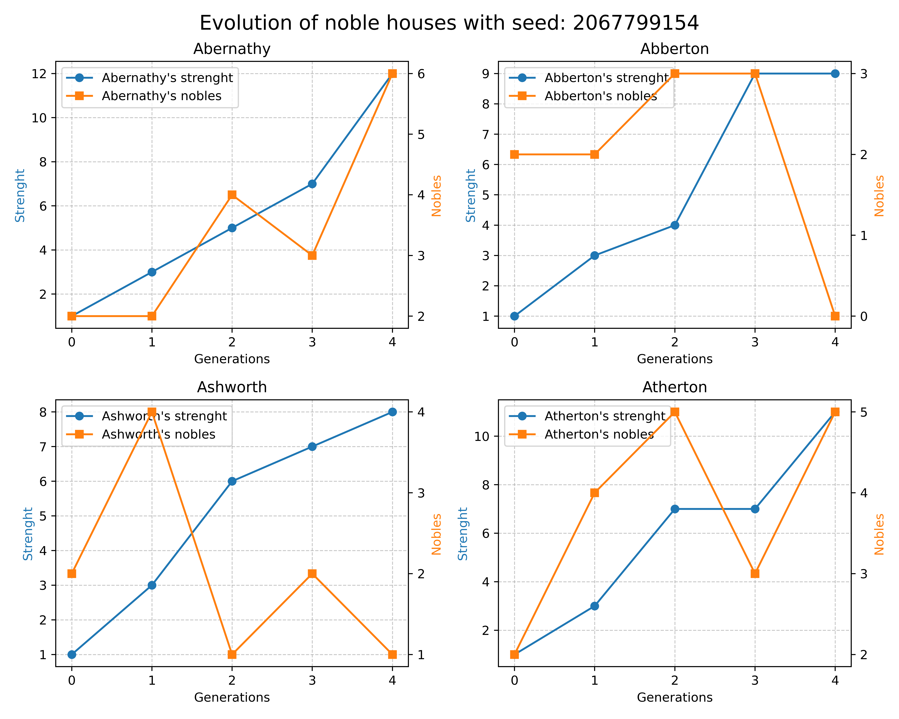

# GenerationalClash

**GenerationalClash** is a C++ game/simulation project that models the evolution of noble houses ("casate") over multiple generations. It tracks the strength and population of each house, simulates marriages, and outputs data for visualization.




#### Table of Contents

- [Features](#features)
- [Requirements](#requirements)
- [Usage](#usage)
- [File Structure](#file-structure)
- [Notes](#notes)
- [License](#license)
- [Contributing](#contributing)


## Features

- Simulates the evolution of multiple noble houses over a configurable number of generations, both declared at runtime.

- Models marriage and inheritance dynamics within nobles of different houses ranking them by a parameter of strength (Check notes for more information on the algorithm).

- Tracks and outputs the strength and number of members for each house per generation.

- Provides a Python script (`plot.py`) to visualize the evolution of each house.

## Requirements

- C++17 or newer
- Python 3 with `matplotlib` and `numpy` for plotting

## Usage

### 1. Build

Use the provided `Makefile` running simply:

```sh
make
```

or compile manually:

```sh
g++ -std=c++17 -o fight main.cpp
```

### 2. Run Simulation

```sh
./fight <seed> <n_houses> <n_generations>
```

- `<seed>`: Random seed (32-bit integer)
- `<n_houses>`: Number of houses (max: 705)
- `<n_generations>`: Number of generations to simulate

Example:

```sh
./fight 43618903 5 10
```

This will produce an output file `generations.out` with the data of the houses through each generation.

### 3. Visualize Results

Create a Python virtual environment, activate it and install dependencies:

```sh
python3 -m venv venv
source venv/bin/activate
pip install -r requirements.txt
```

Then run the plotting script:

```sh
python3 plot.py
```

This will read the output file `generations.out` and plot a graph of the strenght and number of members through each generation and produce an image with the results.

## File Structure
- `main.cpp` : Main simulation driver. Once run it creates another file `generations.out` containing data generation for generation
- `Nobile.h` : Header file of classes and logic
- `plot.py` : Python script for visualization
- `houses_names.txt` : Contains 705 noble houses names inspired by british nobility
- `makefile` : Makefile to compile the code and clean up the output files

## Notes
- Make sure to do a `make clean` before re-running a simulation to clear the output file. Otherwise it will append the new simulation data to the old one.

- The plotting script expects an output file so ensure to run the simulation before calling the script and that the file `generations.out` is present in the directory.

- Nobles from different houses are married to each other and they gain or lose strength through advantageous or disatvantageous marriages. \
    Hypergamy should be encouraged (house of the lower-class noble gains more strenght after marriage), hypogamy should be discouraged (house of higher-class noble gains less strenght after marrying a lower-class noble or even loses some if the marriage is especially disatvangeous).\
    The strength-gain of each house after a marriage is calculated by two functions:

    ```math
    G_{hypergamy} = \frac{1}{2} \Delta + 1
    ```
    ```math
    G_{hypogamy} = -\frac{1}{4} \Delta + 1
    ```

    Where Δ is the difference between the strenght of the two noble houses.
    This way, hypogamy is slightly discouraged and hypergamy is highly rewarded.

## License
This project is licensed under the MIT License - see the [LICENSE.txt](LICENSE.txt) file for details.

## Contributing

Pull requests and suggestions are welcome. For major changes, please open an issue first
to discuss what you would like to change.

___

**Author**: Francesco Specchia \
**Contact**: [francesco.specchia@studenti.unimi.it](mailto:francesco.specchia@studenti.unimi.it)


